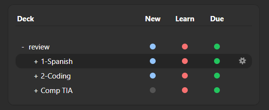
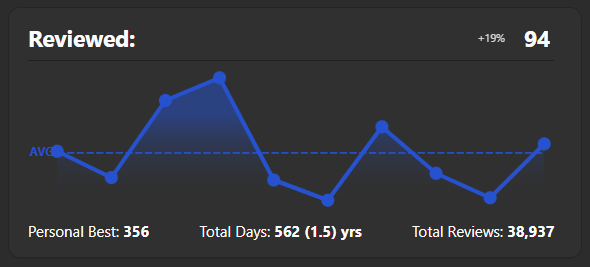
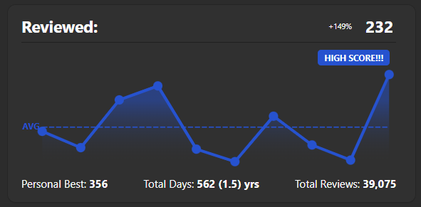
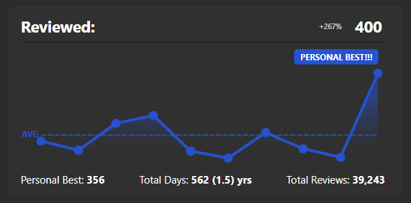

[Anki](https://apps.ankiweb.net) Add on that tries to display stats that encourage you to compete with yourself, and keep going even if you miss a day

Idea for the graphs taken directly from [Aimlabs](https://aimlabs.com).

### Hides flashcards remaining

Replaces the number of remaining flashcards with a dot

### Graphs your flashcard review history

### Displays a small indicator for High Scores and Personal Best

    
    

